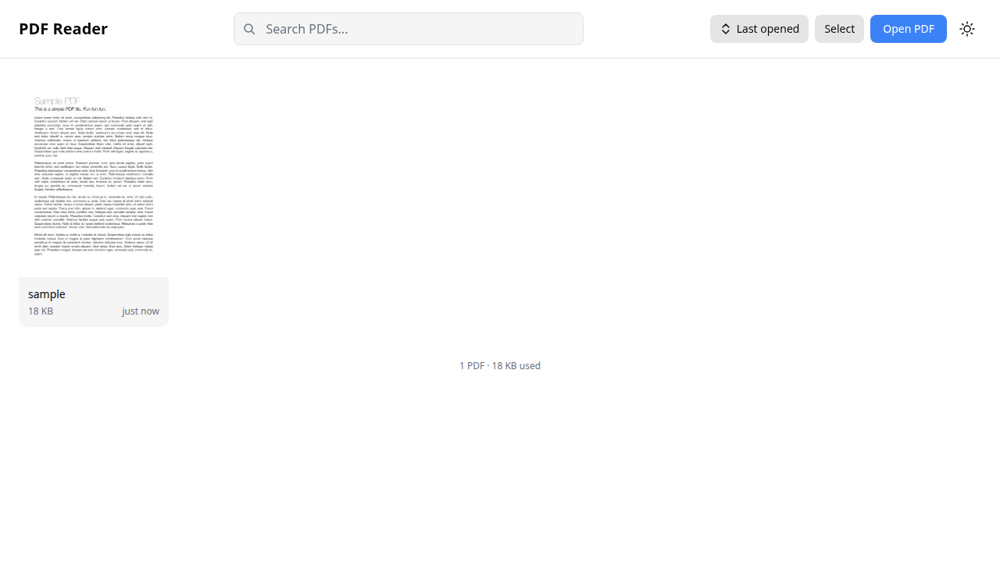
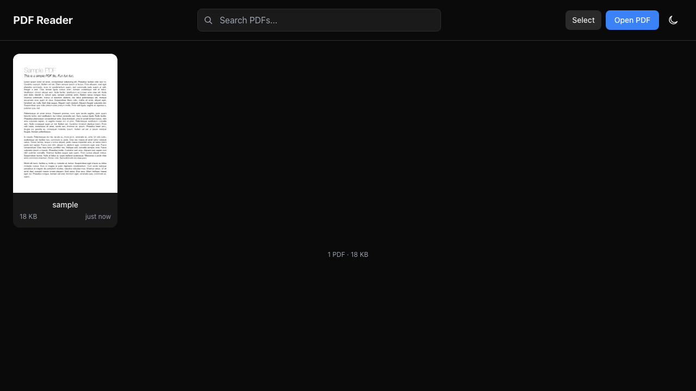
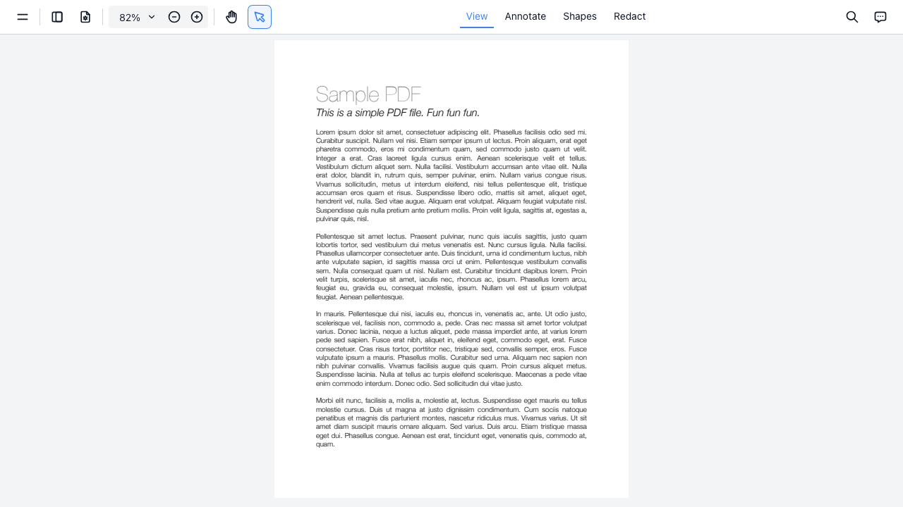
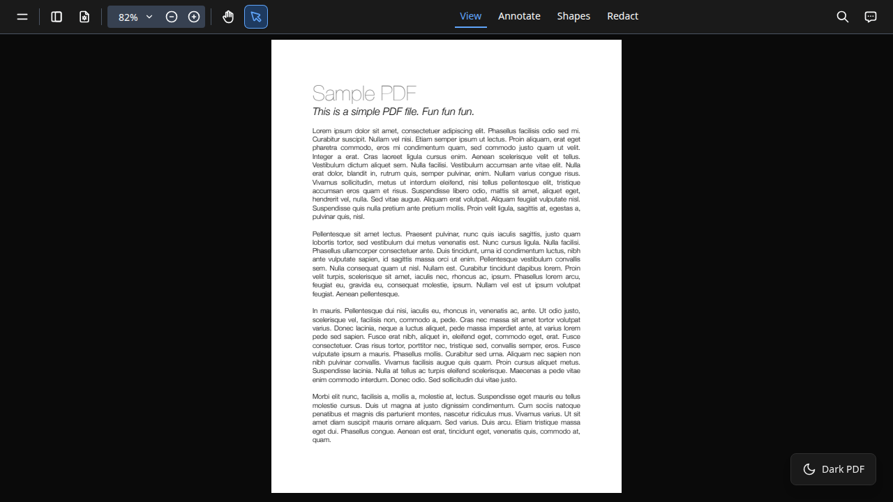

# PDF Reader

[](https://github.com/xavier604/pdf-reader/actions/workflows/docker-publish.yml)
[](LICENSE)

**[Live Demo](https://pdf-reader-gamma.vercel.app/)**

A client-side PDF reader built with [Next.js](https://nextjs.org/) 16, [React](https://react.dev/) 19, and [EmbedPDF](https://embedpdf.com/). All PDF storage and rendering happens in the browser using IndexedDB — no backend required.

## Why

Most PDF readers either require a server, upload your files to the cloud, or lack basic features like annotations and search. This project is a fully offline alternative — your PDFs never leave your browser. It works as a self-hostable web app with Docker, or as a local development tool.

- **Private** — PDFs are stored in IndexedDB, never uploaded anywhere
- **Offline** — Works without an internet connection after first load
- **Self-hostable** — Deploy with Docker on your own server
- **Full-featured** — Zoom, search, annotations, text selection, page navigation

## Screenshots

| Library (light) | Library (dark) |
|:---:|:---:|
|  |  |

| Reader (light) | Reader (dark) |
|:---:|:---:|
|  |  |

## Features

- Import PDFs via file picker or drag-and-drop
- Full-featured reader with zoom, search, text selection, and annotations
- Reading state persistence (page, zoom level) across sessions
- Automatic thumbnail generation
- Star/favorite PDFs to pin them at the top of the library
- Sort library by last opened, date added, title, or file size
- Undo delete with a timed toast notification
- File details modal with metadata and thumbnail preview
- Storage usage indicator with available quota display
- Keyboard shortcuts (press `?` to see all shortcuts)
- Bulk selection and deletion
- Light/dark theme with system preference detection
- Keyboard navigation (Escape to return to library)
- Fully offline — all data stays in your browser

## Getting Started

### Prerequisites

- [Node.js](https://nodejs.org/) 22+
- [pnpm](https://pnpm.io/)

### Setup

```bash
git clone https://github.com/xavier604/pdf-reader.git
cd pdf-reader
pnpm install
pnpm dev
```

Open [http://localhost:3000](http://localhost:3000).

## Scripts

| Command | Description |
|---------|-------------|
| `pnpm dev` | Start development server |
| `pnpm build` | Production build |
| `pnpm start` | Start production server |
| `pnpm check` | Lint and format (Biome) |
| `pnpm test` | Run unit tests (Vitest) |
| `pnpm exec playwright test` | Run E2E tests |
| `pnpm analyze` | Bundle analysis (opens in browser) |

## Docker

```bash
docker build -t pdf-reader .
docker run -p 3000:3000 pdf-reader
```

The included `docker-compose.yml` is for deployment behind a reverse proxy (uses a pre-built GHCR image). See the file for details.

## Project Structure

```
src/
├── app/                    # Next.js App Router pages
│   ├── page.tsx            # Library view (/)
│   └── reader/[id]/        # Reader view (/reader/[id])
├── components/
│   ├── library/            # PDF grid, cards, search, import, sort, file details
│   ├── reader/             # PDF viewer, reading state
│   └── shared/             # Theme, error boundary, dialogs, undo toast
├── lib/
│   ├── db/                 # IndexedDB schema and CRUD
│   ├── hooks/              # useLibrary, usePdfLoader, useTheme, useKeyboard
│   ├── pdf-import.ts       # File validation and import pipeline
│   └── thumbnail-generator.ts
└── types/                  # Shared TypeScript types
```

## Browser Support

Requires a modern browser with support for:

- WebAssembly (PDF rendering engine)
- IndexedDB (PDF storage)
- CSS custom properties (theming)

E2E tested with Chromium, Firefox, and WebKit (Safari).

## Credits

Built with these open-source projects:

- [Next.js](https://nextjs.org/) — React framework by Vercel
- [React](https://react.dev/) — UI library by Meta
- [EmbedPDF](https://embedpdf.com/) — PDF viewer and rendering engine (PDFium via WebAssembly)
- [Dexie.js](https://dexie.org/) — IndexedDB wrapper
- [Tailwind CSS](https://tailwindcss.com/) — Utility-first CSS framework
- [Biome](https://biomejs.dev/) — Linter and formatter
- [Playwright](https://playwright.dev/) — E2E testing framework

## Contributing

Contributions are welcome. See [CONTRIBUTING.md](CONTRIBUTING.md) for guidelines.

## License

[MIT](LICENSE)
